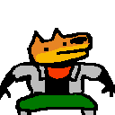
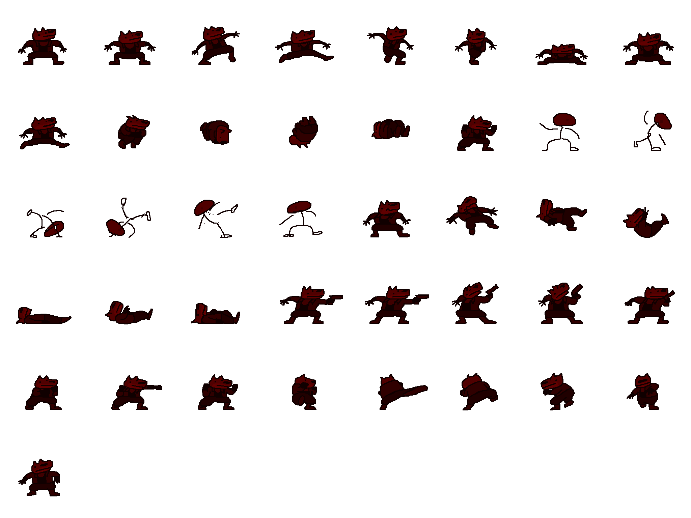

# PLATFORM FIGHTER

This is a platform fighter similar to Smash. There is only one character, Spacedog.

Unlike Smash, this game is much more aerial-based. Fights can happen almost entirely in the air.

There are three tiers of blast zones: The regular blast zone, the double blast zone, and the triple blast zone. Getting knocked off the bottom near the stage will cost you one stock, a bit further away will cost you two, and, if you get knocked off the distant side blast zone, you will lose three stocks.

As you accumulate more and more damage, you will be faced with the choice of risking a triple-death off the side or playing it safe and self-destructing in the single blast zone. At high percents, your opponent's goal will be to PREVENT you from dying off the regular blast zone under the stage to account for lost investment.

## How to play
- Install Godot
- Clone this repo
- Open Godot and import the repo as a project.

## Notes
Made in GODOT

Art made in PISKEL

