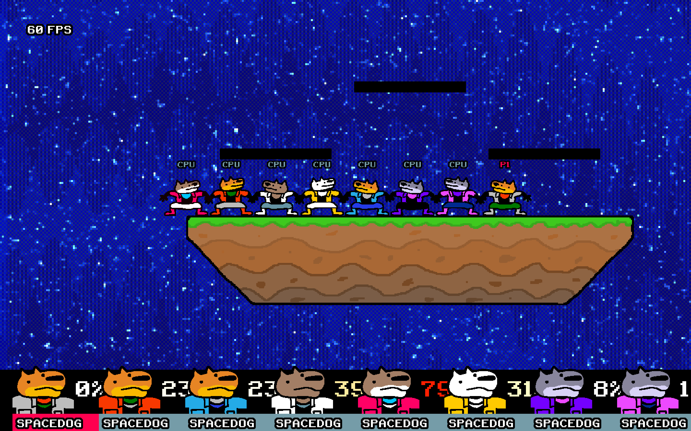
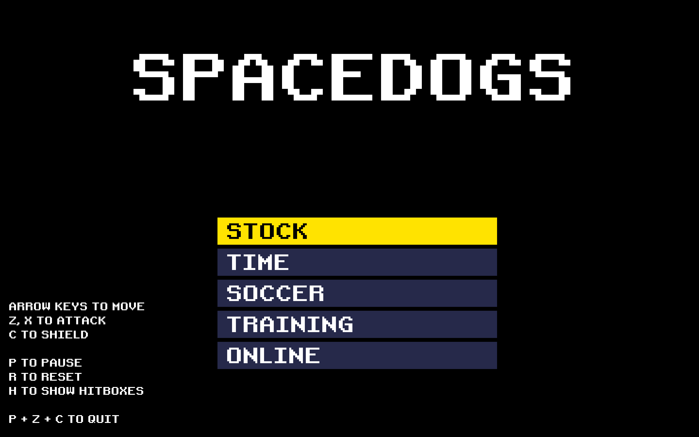

# SPACEDOGS

SPACEDOGS is a platform fighter. There is only one character, SPACEDOG.

Thanks to SPACEDOG'S acrobatic ability, battles can happen almost entirely in the air.

There are three tiers of blast zones: The regular blast zone, the double blast zone, and the triple blast zone. Getting knocked off the bottom near the stage will cost you one stock, a bit further away will cost you two, and, if you get knocked off the distant side blast zone, you will lose three stocks.

As you accumulate more and more damage, you will be faced with the choice of risking a triple-death off the side or playing it safe and self-destructing in the single blast zone.

## How to Play
- Download Godot
- Clone this repo
- Open Godot and import the repo as a project.
- Run the project

## Notes
Made in GODOT

Art made in PISKEL

(c) Liam Norman 2021
